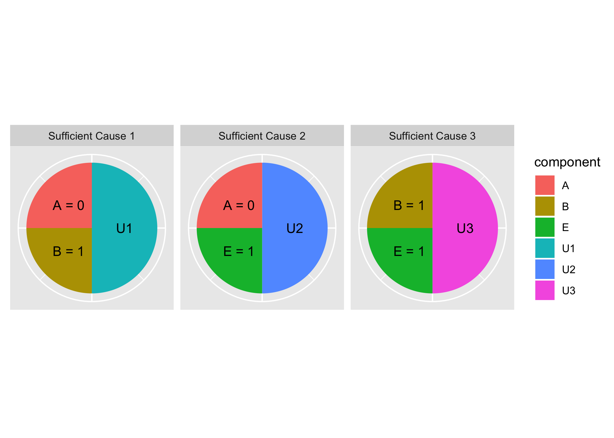
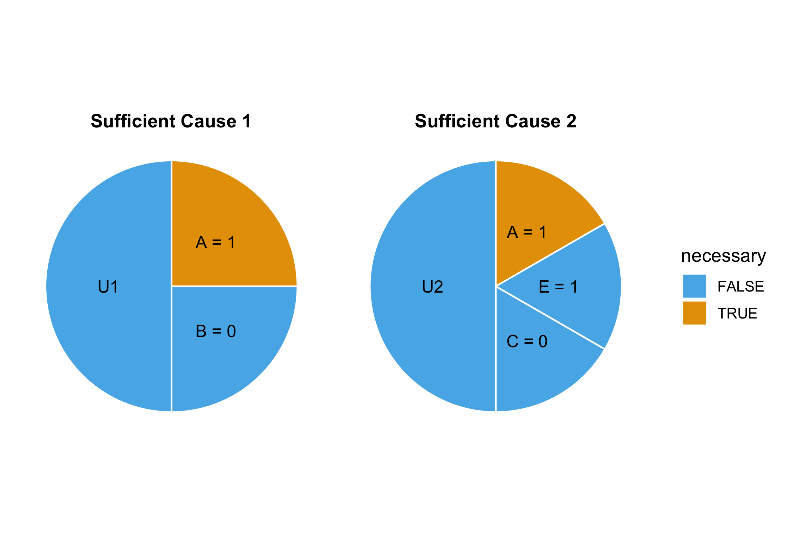

<!-- README.md is generated from README.Rmd. Please edit that file -->

# causalpie: An R Package for easily creating and visualizing causal pies

The goal of causalpie is to …

## Installation

You can install the released version of causalpie from GitHub with:

``` r
# install.packages("devtools")
devtools::install_github("malcolmbarrett/causalpie")
```

## Sufficient causes and causal pies

The sufficient-component cause model (SCC), [proposed by Kenneth Rothman
in 1976](https://pdfs.semanticscholar.org/4da7/76ed2ee2119e70ae46798056baf0f9d69316.pdf),
is a framework for understanding how events occur. Rothman, an
epidemioligist, conceived of SCC to understand the causes of diseases.

Let’s consider an example about disease D. There may be many paths to a
person developing D. We know that A, B, and E all cause D, but we don’t
always need to have all three for D to occur. In SCC, A, B, and E are
referred to as components. The components may combine in a multitude of
ways to cause D. In fact, any of these combination will result in D:

  - A = 0, B = 1
  - A = 0, E = 1
  - B = 1, E = 1

These different combinations are called sufficient causes, because they
are sufficient to cause D. Any component that appears in all sufficient
causes are called necessary causes.

In `causalpie`, you define causes using `causify`. Each sufficient cause
is grouped by the `sc()` function, which takes named values (e.g. E =
1). By tradition, a component `U` is added to each sufficient cause to
represent unknown components. This can be turned off by setting `add_u =
FALSE`.

``` r
library(causalpie)
#> Loading required package: ggplot2
causes <- causify(sc(A = 0, B = 1), 
                  sc(A = 0, E = 1), 
                  sc(B = 1, E = 1))
causes
#> # A tibble: 9 x 5
#>   component value label  frac cause             
#>   <chr>     <chr> <chr> <dbl> <chr>             
#> 1 A         0     A = 0  0.25 Sufficient Cause 1
#> 2 B         1     B = 1  0.25 Sufficient Cause 1
#> 3 U1        ?     U1     0.5  Sufficient Cause 1
#> 4 A         0     A = 0  0.25 Sufficient Cause 2
#> 5 E         1     E = 1  0.25 Sufficient Cause 2
#> 6 U2        ?     U2     0.5  Sufficient Cause 2
#> 7 B         1     B = 1  0.25 Sufficient Cause 3
#> 8 E         1     E = 1  0.25 Sufficient Cause 3
#> 9 U3        ?     U3     0.5  Sufficient Cause 3
```

You can plot the sufficient causes as pies in `ggplot2` using
`causal_pie()`, which highlights unique components, or
`causal_pie_necessary()`, which highlights necessary causes.

``` r
causal_pie(causes)
```



Because both objects are ggplots, you can change themes, scales, and so
on.

``` r
causify(sc(A = 1, B = 0), sc(A = 1, E = 1, C = 0)) %>% 
  causal_pie_necessary() +
  theme_causal_pie() +
  scale_fill_manual(values = c("#56B4E9", "#E69F00"))
```


